# 🚀 Freelancy — Developer Assessment & Challenge Platform

> A full-stack microservices platform for evaluating developer talent through real-world coding challenges, proctored assessments, and automated CI/CD pipelines — deployed on Kubernetes with full observability.

---

## 📌 Table of Contents

- [Overview](#overview)
- [Architecture](#architecture)
- [Core Features](#core-features)
  - [Challenge System](#-challenge-system)
  - [Exam & Assessment System](#-exam--assessment-system)
  - [Admin Dashboard](#-admin-dashboard)
  - [DevOps & Infrastructure](#-devops--infrastructure)
- [Tech Stack](#tech-stack)
- [Screenshots](#screenshots)
- [Getting Started](#getting-started)

---

## Overview

**Freelancy** is a comprehensive developer evaluation platform built with a microservices architecture. It allows organizations to:

- Publish real-world coding challenges with **automated GitHub repository provisioning**
- Run **proctored technical exams** with AI-powered cheating detection
- Monitor code quality via **SonarQube** analysis triggered on every candidate push
- Observe all services in real-time through **Prometheus + Grafana** dashboards
- Deploy everything on a **Vagrant-provisioned Kubernetes cluster** with full CI/CD via Jenkins

---

## Architecture

The platform is composed of the following microservices, all containerized with Docker and orchestrated via Kubernetes:

| Service | Port | Description |
|---|---|---|
| `api-gateway` | 8091 | Single entry point — routes and secures all requests |
| `eureka-server` | 8761 | Service discovery & registration |
| `challenge-service` | 8077 | Coding challenges, GitHub repo provisioning, SonarQube triggers |
| `examquiz-service` | 8150 | Proctored exams, cheating detection, real-time monitoring |
| `frontend` | — | Angular SPA for candidates and admins |
| `mysql-challenge` | — | Dedicated database for challenge-service |
| `mysql-examquiz` | — | Dedicated database for examquiz-service |
| `prometheus` | — | Metrics collection from all services |
| `grafana` | — | Visualization dashboards |

Security is handled by **Keycloak** + **JWT** across all services, enforced at the API Gateway level.

---

## Core Features

### 🏆 Challenge System

Candidates browse and join coding challenges filtered by technology, difficulty, and duration.

- **950+ active challenges** across DevOps, Backend, Web, Machine Learning, and more
- Difficulty levels: Beginner / Intermediate / Advanced / Expert
- Upon joining, the platform **automatically provisions a private GitHub repository** for the candidate via the GitHub API — no manual steps required
- Every push by the candidate triggers a **GitHub Actions pipeline** that runs a **SonarQube static analysis** on the submitted code
- Admins track progress per challenge: task completion status, points earned, and deadline countdowns
- **AI-powered challenge generation** — create a full challenge from a topic, technology, or skill description

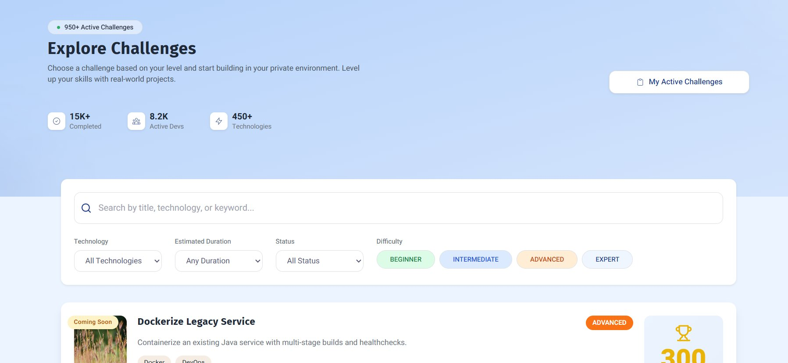
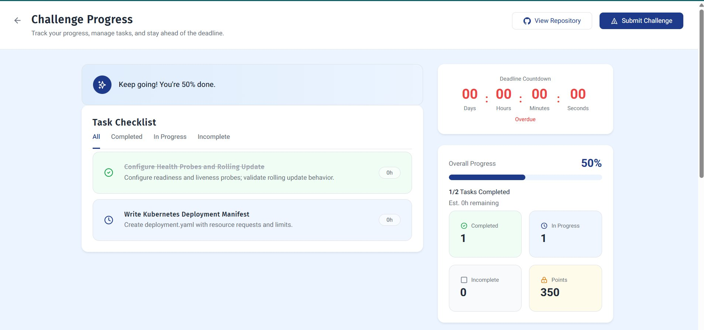

---

### 📝 Exam & Assessment System

A proctored exam engine with strict academic integrity enforcement.

- Configurable exams: duration, number of questions, passing score, max attempts, and results visibility
- **Fullscreen enforcement** — exiting fullscreen is flagged as a violation
- **Copy/paste disabled** during the exam session
- **Live webcam proctoring**: detects absence of face, presence of a phone, or a second person in the room using the browser camera
- **Real-time suspicion scoring** — each violation increments a risk score visible to admins
- Admins access the **Live Proctoring Monitor** to observe active candidates mid-exam, inspect event logs, and manually block any suspicious user
- All cheating events (`TAB_SWITCH`, `NO_FACE_DETECTED`, etc.) are logged with timestamps and severity labels
- Operational analytics: success rate, failure rate, cheating rate, auto-submitted attempts

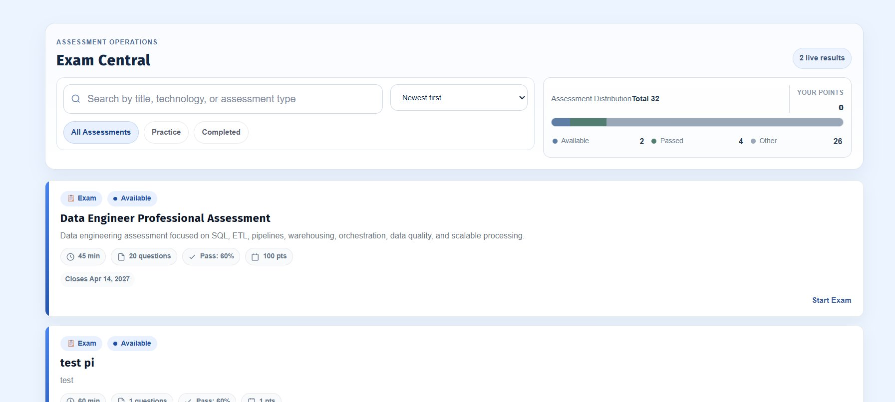
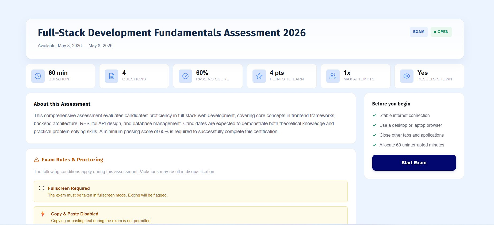
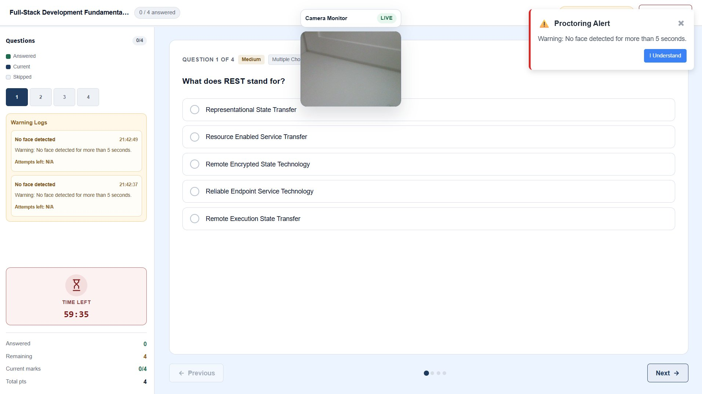

---

### 🛠 Admin Dashboard

A feature-rich admin interface for managing the entire platform:

- Challenge creation (manual or AI-generated) with technology and category analytics
- Task-level completion analytics across all challenges
- Assessment distribution overview with live result tracking
- Real-time proctoring command center with per-candidate suspicion scoring and block actions

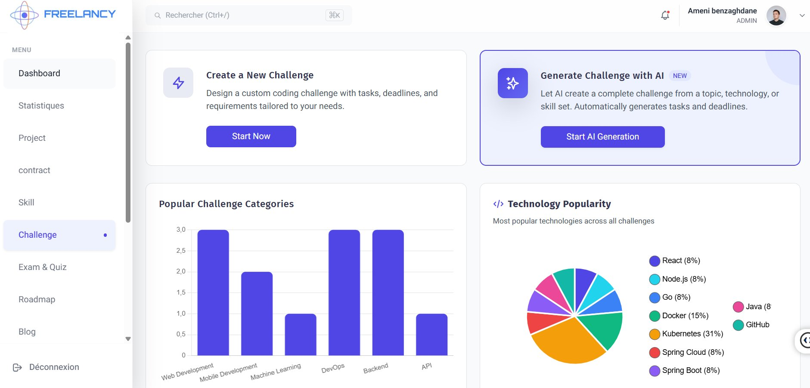
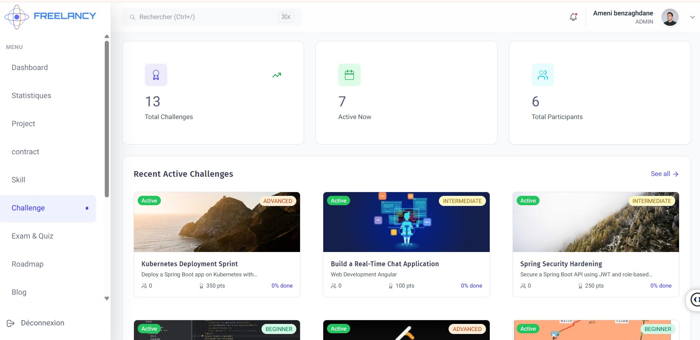
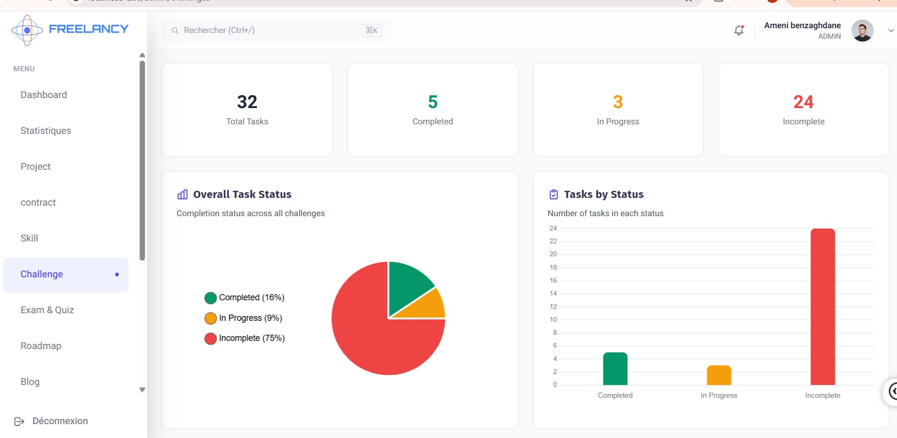
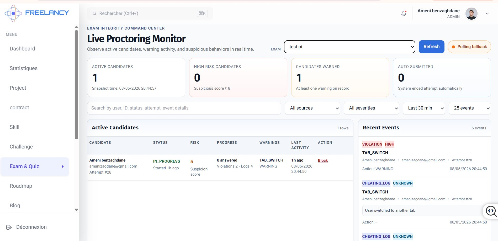
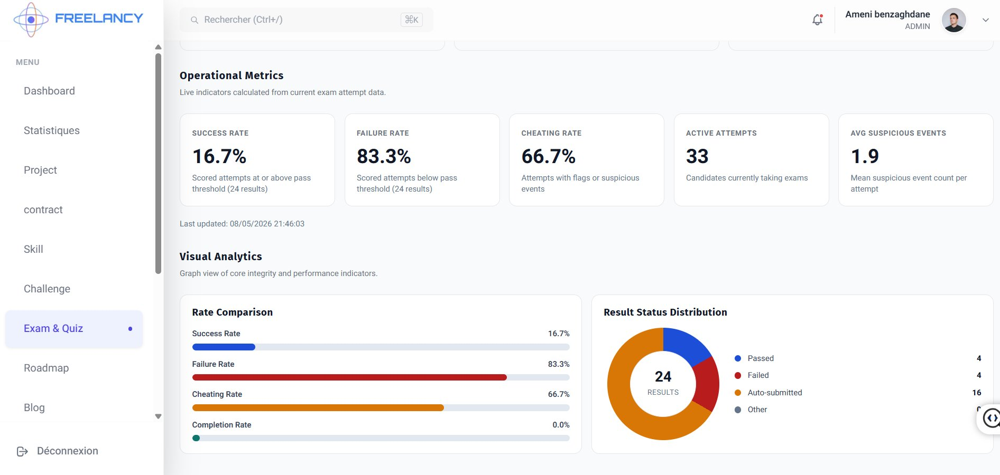

---

### ⚙️ DevOps & Infrastructure

The entire platform is provisioned on a **Vagrant VM** running a local Kubernetes cluster.

#### CI/CD — Jenkins

Separate CI and CD pipelines exist for every service:

| Pipeline | Last Successful Build | Avg Duration |
|---|---|---|
| ApiGatewayPipeline-CI | 1d 17h ago | 5m 2s |
| ApiGatewayPipeline-CD | 2d 22h ago | 3m 46s |
| ChallengePipeline-CI | 1d 17h ago | 9m 30s |
| ChallengePipeline-CD | 3d 2h ago | 4m 4s |
| ExamQuizPipeline-CI | 3d 3h ago | 3m 9s |
| ExamQuizPipeline-CD | 3d 3h ago | 3m 43s |
| EurekaPipeline-CI | 1d 17h ago | 5m 28s |
| FrontendPipeline-CI | 2d 22h ago | 9m 24s |

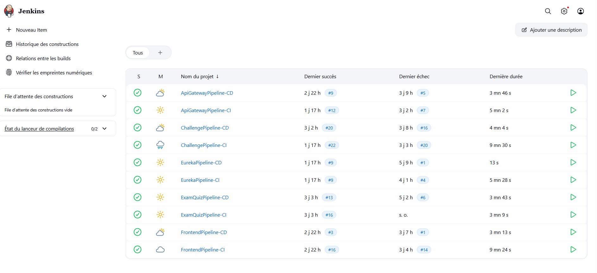

---

#### Docker Hub

All service images are published to the `ameni221` namespace on Docker Hub:

- `ameni221/freelancy-frontend`
- `ameni221/challenge-service`
- `ameni221/api-gateway`
- `ameni221/eureka-service`
- `ameni221/examquiz-service`

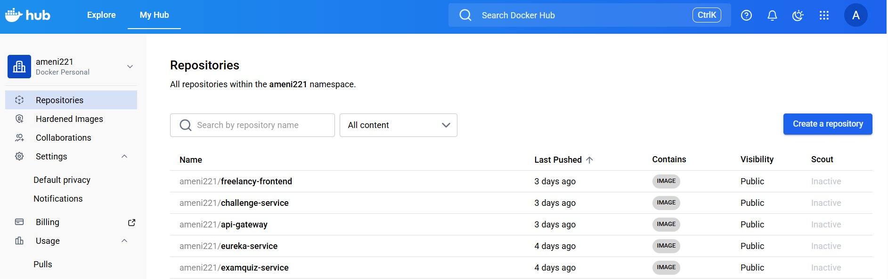

---

#### Kubernetes Deployment (Vagrant)

All pods running in the `freelancy` namespace:

```bash
kubectl get pods -n freelancy

NAME                                          READY   STATUS    RESTARTS   AGE
api-gateway-deployment-75bccb7869-gt9mz       1/1     Running   3          97m
challenge-deployment-f599cbbd5-8qb6w          1/1     Running   8          3d11h
eureka-deployment-99c85bb7b-cjjg5             1/1     Running   8          3d11h
examquiz-deployment-77d946968-dv5dt           1/1     Running   9          3d11h
frontend-deployment-b69fb7f45-wv4s8           1/1     Running   6          3d6h
grafana-85f97d9846-8wc69                      1/1     Running   8          3d11h
mysql-challenge-976f79d8-l4c5s                1/1     Running   10         3d11h
mysql-examquiz-5969d9bcd6-6988b               1/1     Running   10         3d11h
prometheus-56bdb6b6-fmk28                     1/1     Running   8          3d11h
```

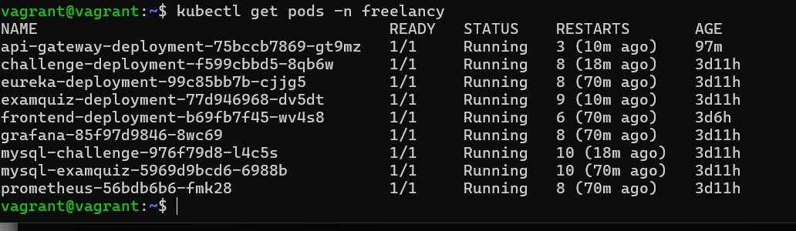

---

#### Code Quality — SonarQube Cloud

All backend services are analyzed via the `Freelancy-organization` SonarQube organization:

| Service | Security | Reliability | Maintainability | Coverage |
|---|---|---|---|---|
| `challenge-service` | A (0 issues) | A (0 issues) | A (62 smells) | 77.1% |
| `eureka-server` | A (0 issues) | A (0 issues) | A (0 smells) | 0.0% |
| `examquiz-service` | D (29 issues) | E (1 issue) | A (50 smells) | 67.8% |

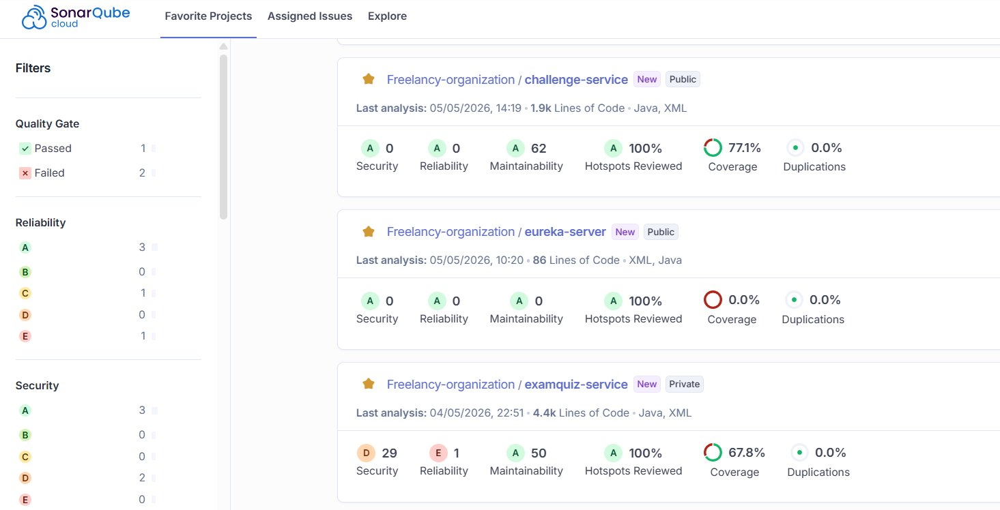

---

#### Monitoring — Prometheus + Grafana

All services expose `/actuator/prometheus` and are scraped by Prometheus:

| Target | Instance | Status |
|---|---|---|
| api-gateway | api-gateway-service:8091 | ✅ UP |
| challenge-service | challenge-service:8077 | ✅ UP |
| eureka-server | eureka-service:8761 | ✅ UP |
| examquiz-service | examquiz-service:8150 | ✅ UP |

Grafana dashboards provide real-time JVM statistics, CPU usage, heap/non-heap memory, load average, and HikariCP connection pool metrics — per service instance.

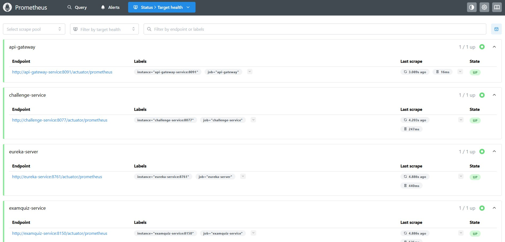
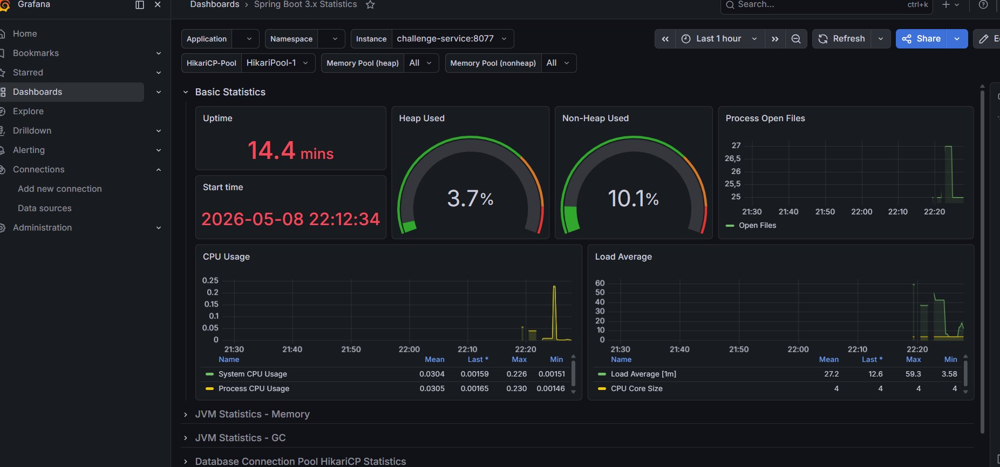

---

## Tech Stack

| Layer | Technologies |
|---|---|
| **Backend** | Spring Boot, Spring Cloud (API Gateway, Eureka, Config Server) |
| **Frontend** | Angular |
| **Security** | Keycloak, JWT |
| **Databases** | MySQL (dedicated instance per service) |
| **Containerization** | Docker, Docker Hub |
| **Orchestration** | Kubernetes (Vagrant VM) |
| **CI/CD** | Jenkins (separate CI + CD pipeline per service) |
| **Code Quality** | SonarQube Cloud, GitHub Actions |
| **Monitoring** | Prometheus, Grafana |
| **VCS & Automation** | GitHub API (auto repo provisioning), GitHub Actions |

---

## Screenshots

All screenshots are located in the `documentation/` folder on the `documentation` branch.

| File | Description |
|---|---|
| `01_explore_challenges.png` | Challenge catalog with difficulty and technology filters |
| `02_challenge_progress.png` | Candidate challenge progress with task checklist and countdown |
| `03_exam_central.png` | Exam Central — browse and start available assessments |
| `04_exam_detail.png` | Exam detail page: rules, proctoring requirements, and start |
| `05_exam_live_proctoring.png` | Live exam view with webcam monitor and violation alert |
| `06_admin_live_proctoring_monitor.png` | Admin real-time proctoring command center |
| `07_admin_exam_analytics.png` | Exam operational metrics and result distribution chart |
| `08_admin_challenge_dashboard.png` | Challenge management with AI generation and tech popularity |
| `09_admin_challenge_list.png` | Active challenges with participants and point values |
| `10_admin_challenge_task_analytics.png` | Task completion analytics across all challenges |
| `11_sonarqube_projects.png` | SonarQube Cloud code quality metrics per service |
| `12_prometheus_targets.png` | Prometheus — all microservice targets UP |
| `13_grafana_jvm_dashboard.png` | Grafana JVM + CPU + memory dashboard for challenge-service |
| `14_kubernetes_pods.png` | Kubernetes pods running in the `freelancy` namespace |
| `15_docker_hub_repositories.png` | Docker Hub — published images for all services |
| `16_jenkins_pipelines.png` | Jenkins CI/CD pipeline status for all services |

---

## Getting Started

> Requires Vagrant and VirtualBox installed on your host machine.

```bash
# 1. Clone the repository
git clone https://github.com/<your-org>/freelancy.git
cd freelancy

# 2. Start the Vagrant VM
vagrant up

# 3. SSH into the VM
vagrant ssh

# 4. Verify all pods are running
kubectl get pods -n freelancy

# 5. Access the frontend
kubectl port-forward svc/frontend-service 4200:80 -n freelancy
```

For Jenkins, Prometheus, and Grafana access, refer to the `devops/` directory for service configurations and NodePort assignments.

Each service module contains its own:
- `Dockerfile`
- `Jenkinsfile` (CI + CD stages)
- Kubernetes manifests (`deployment.yaml`, `service.yaml`, `configmap.yaml`)
- SonarQube quality gate configuration

---

*Built with Spring Boot · Angular · Kubernetes · Jenkins · SonarQube · Prometheus · Grafana*
